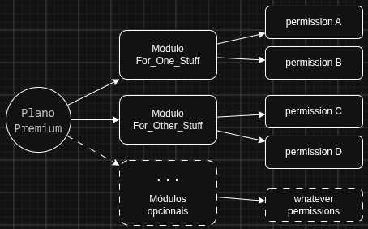
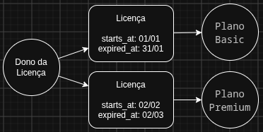

# Gerenciador estoque/venda

Esta documentação tem por objetivo descrever todas as particularidades do sistema que é responsável por gerenciar todo o processo de saída e entrada de estoque de produtos e venda deles para clientes.

## Tecnologias utilizadas

### Frontend

- [Bootstrap](https://getbootstrap.com/docs/5.3)
- [flatpickr](https://flatpickr.js.org/)
- [inputmask](https://robinherbots.github.io/Inputmask/) 

### Backend

- [Brick\Math](https://github.com/brick/math)
- [intervention/image-laravel](https://github.com/Intervention/image-laravel)
- [spatie/dropbox-api](https://github.com/spatie/dropbox-api)
- [spatie/laravel-permission](https://spatie.be/docs/laravel-permission/v8)

## Arquitetura inicial

Inicialmente o sistema irá utilizar de uma estratégia arquitetural, uma variação de RBAC (Role-Based Access Control), em que "permissions" foram criadas definindo atividades em que o usuário é liberado a realizar. De forma conjunta, uma abstração denominada "roles" simbolizando um módulo, foi criada separadamente ligam-se a grupos de atividades possíveis, criadas anteriormente através de permissions. Por exemplo, todas as permissões relacionadas a clientes (buscar, criar, editar, remover um registros, remover vários registros, etc) poderá estar relacionado à uma "role" nomeada como "FOR_CUSTOMER".

Para que o usuário possa futuramente, através de pagamentos, adquirir acesso a planos, foi criado uma abstração chamada "plans", simbolizando o plano, com um preço especificado e vários possíveis papéis ("roles") relacionados, tanto fixos quanto opcionais, no qual o usuário pode pagar e realizar diversas tarefas permitidas conforme as permissões relacionadas a esses papéis definidos. O plano estaria então ligado a arranjos de uma ou mais "roles", possibilitando assim um acesso bem diversificado de permissões.

Os planos começam com nenhum módulo opcional adicionado e o futuro dono da licença, chamado internamente de "*licensable*", fica a cargo de escolher quais módulos (papéis) opcionais devem acompanhar o plano. Atualmente cada módulo opcional, chamado internamente de "*additionals*", tem um preço adicional de cinquenta centavos (R$ 0,50), mas a idéia é que futuramente cada módulo possua seu próprio valor atrelado.

A partir desse contexto, uma abstração "licenses" foi criada para servir de aspecto aquisitivo e temporal do usuário ao plano de acesso, com diversas informações importantes como data de inicio e data de expiração.

## Detalhes do Plano

### billing_period

O plano possui o que chamamos de "período de faturamento", ou seja, define se o acesso do usuário deve perdurar através do seguintes períodos: 

- **NONE** (nenhum): Utilizado somente como label em seletores onde o período possui a possibilidade de não ser definido.
- **BIWEEKLY** (quinzenalmente): Utilizado para licensas disponíveis somente durante catorze dias contratados.
- **MONTHLY** (mensalmente): Utilizado para licensas disponíveis somente durante os meses contratados.
- **QUARTERLY** (trimestral): Utilizado para licensas disponíveis somente durante os trimestres contratados.
- **YEARLY** (anualmente): Utilizado para licensas disponíveis somente durante os anos contratados.

## Licença

A licença simboliza o elo entre o usuário e o plano de acesso pré-definido. Através da licença é registrado se o "*licensable*" necessita de recorrência após a expiração do acesso, qual será é o proprietário da licença, todas as variações de definição de preço pago pela licença, se o preço pago por ela possui algum tipo de cupom de desconto, se possui "*additionals*", 

### Detalhes da Licença

#### starts_at

Define a data de início do uso da licença pelo usuário.

#### expires_at

Define a data final do uso da licença pelo usuário.

#### is_recurring

Define se a licença é recorrente e, após o término de seu "_billing_period_", deve ser renovada após sua expiração. Esse campo será desconsiderado pelo sistema se caso o usuário solicitar o cancelamento da licença atual. Verifique a descrição do campo **cancelled_at** e o status ***CANCELED***.

#### status

Define o status que a licença pode possuir durante todo o seu tempo de vida. Dentre eles temos:

- ***ACTIVE***: Define quando a licença encontra-se ativa e sendo utilizada pelo usuário. Depende dos campos **starts_at** e **expires_at**.
- ***EXPIRED***: Define quando a licença não encontra-se mais ativa e o usuário já utilizou ela completamente.
	> ***NOTA***: Diariamente à meia-noite exitirá um *job* que ficará encarregado de realizar a busca por licenças com status *ACTIVE*, com o campo *cancelled_at* como *null* e com o campo *expires_at* maior que a data atual, transformando o status de todas elas para *EXPIRED* e consequentemente removendo todas as "roles" do dono da licença. Caso o campo *cancelled_at* esteja populado com alguma data, o status da licença será modificado para *CANCELED*.

- ***CANCELED***: Define quando a licença foi cancelada previamente pelo usuário e já ultrapassou a data presente em *expires_at*, ou seja, o dono da licença tomou a decisão de não continuar com a recorrência de novas licenças no fim do uso do plano atual. Caso o dono da licença marque-a como "cancelável" antes dela ultrapassar a data presente em *expires_at*, ele ainda continuará ativa e com o acesso liberado na aplicação, até que a data atual ultrapasse *expires_at*, modificando por fim o status da licença para *CANCELED*, descrito nesse item (através de um *job* responsável por isso).

	> ***NOTA 1***: A regra de negócio acima declarada deve ocorrer da maneira descrita devido ao fato de que, após realizar o pagamento do acesso (pelo mês inteiro, por exemplo), mesmo que o "*licensable*" cancele o uso da licença, ele ainda possui o direito de uso legal e comercial de acesso ao sistema, pelo restante dos dias pagos mas não utilizados.
    > ***NOTA 2***: O usuário pode solicitar o cancelamento da licença somente enquanto ela estiver com o seu status como *ACTIVE* e com a data atual menor ou igual ao campo *expires_at*. Ao solicitar o cancelamento, a licença receberá a data atual no campo *cancelled_at*.
	> ***NOTA 3***: Diariamente à meia-noite exitirá um *job* que ficará encarregado de realizar a busca por licenças com status *ACTIVE*, com a data atual anterior a três dias do campo *expires_at* e com o campo *cancelled_at* com o valor *null*. Em caso afirmativo, será enviando assim um email ao dono da licença informando que a ela se extinguirá, anexando junto uma nova cobrança ao mesmo, conforme necessário. Para licenças com todas as condições acima confirmadas, mas que possuam o campo *cancelled_at* populado com alguma data, nenhum email será enviado e a licença adquirirá neste momento o status de *CANCELED*.
	
- ***PENDING***: Define quando a licença encontra-se pendente de aprovação (seja pelo super-admin, ou pelo webhook do gateway). A criação de licenças com este status pode ocorrer quando o dono de licença:
	+ não possuir nenhuma licença ativa no momento.
	+ possuir licença ativa, mas está solicitando a troca de seu plano de acesso atual (*downgrade*/*upgrade*).

	Para casos de troca de plano de acesso, o sistema dividirá o valor atualmente gasto, para a aquisição do plano, por todos os dias de acesso que plano disponibiliza, definindo assim o valor cobrado por um único dia de acesso a esse plano. Esse valor será então multiplicado pela soma dos dias restantes de acesso que o dono da licença ainda possui, definindo assim o chamado *valor de pro rata*.
	Esse resultado de *pro rata* será descontado do valor do plano ao qual o usuário está solicitando a troca.
	Caso esse resultado seja maior que o valor do plano solicitado, o restante será registrado como crédito relacionado à licença e ao dono da licença.
	> ***NOTA 1***: Durante o cálculo de *pro rata*, o sistema verifica também se existe algum histórico de crédito já existente vinculado ao dono da licença (desconsiderando créditos oriundos de licenças com status *PENDING* ou *ABANDONED*). Se houver, esse crédito será anulado/estornado na base de crédito e seu valor será somando ao resultado de *pro rata*, aplicando assim esse desconto somado ao preço do plano ao qual o usuário está solicitando a troca. Caso esse desconto somado seja maior que o preço do novo plano, a diferença será guardanda novamente como crédito ao dono da licença.

- ***CHANGED***: Define quando o status da licença passou pelo processo de troca de plano de acesso. Esse evento ocorre em dois momentos distintos:
	+ quando o valor de "*pro rata* + *créditos acumulados*" é maior ou igual ao preço do plano de acesso ao qual o dono da licença deseja transicionar. Ele recebe a ativação imediata da licença do novo plano, a partir da data da solicitação atual e sem custo nenhum. A licença anterior recebe então o status *CHANGED* e seu campo *expires_at* recebe a data da solicitação atual.
	+ quando o valor de "*pro rata* + *créditos acumulados*" é menor ao preço do plano de acesso ao qual o dono da licença deseja transicionar. Uma licença com status *PENDING* é então criada e fica aguardando uma posterior ativação com base no pagamento da diferença de preço (seja através da liberação manual pelo *super-admin*, ou pelo recebimento de uma requisição oriunda de um *webhook endpoint*).
- ***ABANDONED***: Define quando o status da licença passou pelo processo de abandono de licença. Esse evento ocorre em quatro momentos distintos:
	+ quando o usuário não possui nenhuma licença ativa, solicitou uma nova licença de acesso e não realizou o pagamento antes do prazo máximo dessa cobrança. Essa mudança de status dessa licença ocorre através de um *job* responsável por buscar licenças presentes dentro desse contexto e que executa sempre no início do dia posterior.
	+ quando o usuário possui uma licença ativa, solicitou a troca para um novo plano de acesso e não realizou o pagamento antes do prazo máximo dessa cobrança. Essa mudança de status dessa licença também ocorre através de um *job* responsável por buscar licenças presentes dentro desse contexto e que executa sempre no início do dia posterior.
	+ quando o usuário encontra-se em qualquer um dos dois primeiros casos citados acima, mas após solicitar uma nova licença resolve solicitar novamente outro novo plano de acesso abandonando o pedido anterior, ou seja, realiza a troca uma nova solicitação por outra nova solicitação. Isso ocasiona a modificação imediata do status da license anterior de *PENDING* para *ABANDONED*, mantendo a última ainda como *PENDING*.
	+ quando o usuário encontra-se em qualquer um dos dois primeiros casos citados acima, mas após solicitar uma nova licença resolve apenas cancelar essa solicitação. Isso ocasiona também a modificação imediata do status dessa license de *PENDING* para *ABANDONED*.

## Pagamentos

Os pagamentos advindos de cobranças de licenças de acesso, são registradas no sistema como faturas, mas precisamente como "*invoices*" e são registradas e relacionadas tanto ao "*licensable*" e quanto às licenças inicializadas com o status *PENDING*. A *invoice* também apresenta campos que definem seu *método de pagamento* (fixo) e *status* (variável).
  > A *invoice* geralmente é gerada apresentando um valor resultante da soma, entre o valor do plano com a soma do preço dos opcionais, subtraindo então desse resultado a soma dos descontos adquiridos por meio dos créditos acumulados do "*licensable*" com o valor de *pro rata* restante do plano atual.  Se o valor resultante de todo esse cálculo for maior que zero, uma "*invoice*" será criada com esse valor restante e com status "*PENDING*".

### Métodos de pagamento

Quanto ao método do pagamento, são categorizadas como:

- *BANK_SLIP*: O método conhecido como pagamento por boleto.
- *CREDIT_CARD*: Utiliza diversas bandeiras de cartões como forma de pagamento.
- *PIX*: literamente o pix.
- *BANK_TRANSFER*: O método conhecido transferência bancária.
- *MONEY*: Utiliza dinheiro em espécie.

> ***NOTA***: Quando o sistema passar por um processo de geração de cobrança que utilize "*BANK_SLIP*", o boleto sempre deverá expirar no dia seguinte. Enquanto isso, o sistema esperará a requisição de aviso de pagamento feito pelo gateway ao *webhook endpoint*. No dia seguinte, quando o *job* executar a busca por licenças com status *PENDING*, ele verificará a forma de pagamento das *invoices* atreladas a essa licença. Se for "*BANK_SLIP*", ele pegará o campo *gateway_transaction_id* fornecido pelo gateway à invoice e realizará posteriormente uma requisição ao mesmo solicitando o cancelamento do boleto atrelado a esse identificador.

### Status da invoice

Quanto ao status, pode ser modificável durante o ciclo de vida da *invoice* e pode ser categorizado como:

- *PENDING*: primeiro valor de status que a *invoice* adquire após sua criação.
- *PAID*: status final gerado durante a ativação da licença, disparada de forma manual pelo super-admin, ou através uma resposta automática gerada por uma requisição, oriunda de um *gateway* externo, ao *webhook endpoint* do sistema.
- *VOIDED*: status final gerado durante a anulação voluntária e manual da *invoice*. Pode ocorrer quando o *licensable* solicita o cancelamento de uma licença com status *PENDING*, seja por cancelamento direto ou proveniente de uma resolicitação de outro plano de acesso distinto. Importante salientar que, caso durante esses casos o pagamento seja feito através do método "*BANK_SLIP*", o gateway vinculado deve ser notificado para que os boletos relacionados sejam cancelados.
- *EXPIRED*: status final gerado durante a execução do *job* sempre à meia-noite que busca por licenças com status *PENDING*. Ele passa o status das licenses para *ABANDONED* e o status das *invoices* relacionadas a elas para *EXPIRED*.
- *FAILED*: status provisório gerado quando ocorre uma tentativa ativa de pagamento que deu errado. Esse status é de extrema importância para rastrear problemas técnicos, de limite de crédito ou fraudes no sistema. Resumidamente, o usuário pegou o cartão de crédito, clicou em pagar e o gateway retornou um erro, ou seja houve uma tentativa de ação que falhou.
    > ***NOTA 1***: No banco de dados, a *invoice* passará para o status *FAILED* (disparado geralmente pelo *webhook endpoint*/*gateway*) nos seguintes cenários:
    > - *Cartão Recusado*: O banco do cliente negou a transação (por falta de limite, suspeita de fraude ou cartão bloqueado).
    > - *Erro de Autenticação*: Falha no 3D Secure (aquela verificação que o app do banco pede para aprovar compras online).
    > - *Dados Incorretos*: O usuário digitou o número do cartão, data de validade ou código CVV errado repetidas vezes.
    > - *Falha sistêmica no Pix*: Casos raros onde o gateway tenta registrar a transação na rede do Banco Central e ocorre um erro de comunicação.
    >
    > ***NOTA 2***: Durante uma falha de pagamento, o usuário ainda está tentando realizar a compra, pode querer tentar utilizar outro cartão ou mudar o método de pagamento para pix. Enquanto isso:
    > - a licença se mantêm com o status *PENDING*.
    > - o usuário é notificado na tela com o erro exato retornado pelo gateway (ex. "Cartão recusado. Verifique seu limite ou entre em contato com o banco emissor.").
    > - o usuário deve ser liberado para tentar novamente o pagamento.
- *REFUNDED*: status final gerado quando o usuário, dentro de um prazo de 7 dias, solicita o reembolso do dinheiro pago pelo acesso (apenas o valor pago a mais pelo acesso e registrado através das invoices da licença, sem contar com pro ratas ou com crédito utilizados).

    > ***NOTA***: No Brasil, para compras feitas pela Internet, o consumidor tem o prazo de 7 (sete) dias para desistir da compra e pedir o reembolso total. Esse é o chamado "direito de arrependimento", previsto no artigo 49 do Código de Defesa do Consumidor (CDC).

## Cupons de desconto

Existe a possibilidade de inserção de cupons de desconto para aplicar algum tipo de desconto no valor a ser pago por algum plano de acesso (no momento da criação da licença). Possui dois tipo: **PERCENTAGE** ou **FIXED**.

> ***Nota***: Descontos podem ser armazenados no banco de dados, e a verificação da possibilidade da aplicação do cupom no preço durante o momento da criação da licença já existe atualmente implementado, porém todos os outros fluxos necessários para criar o cupons, divulgar e a liberação para o usuário utilizar eles ainda não foram implementados.

## Análise de produto, recuperação de vendas e prevenção de fraudes (perante invoices)

### Métricas de Conversão e Saúde do Checkout

Através da possibilidade de definição do status das invoices para "*FAILED*" é possível obter a visibilidade da taxa de aprovação do checkout.

- Se a invoice fica com status de *EXPIRED*: O cliente gerou a cobrança e desistiu (nem tentou pagar). O problema pode ser o preço ou o interesse.
- Se a invoice fica com status de *FAILED*: O cliente queria comprar, mas o sistema/banco não deixou. O problema é técnico ou de limite de crédito.

Saber o volume de invoices com status de *FAILED* permite ao seu time responder a perguntas como:

- "Por que 20% das vendas via cartão estão falhando justamente na sexta-feira à noite?" (Pode indicar instabilidade na adquirente ou regra de antifraude muito agressiva)
- "Quantos clientes tentaram comprar com cartão recusado e acabaram não gerando Pix em seguida?"

### Campanhas de Recuperação de Vendas (Retargeting de Suporte/Marketing)

Saber o momento exato em que uma cobrança que falhou expirou (ou seja, o prazo máximo para tentar pagar novamente acabou) permite criar réguas de comunicação cirúrgicas:

- E-mail de Recuperação Imediata (no momento da falha): "Seu cartão foi recusado. Clique aqui para tentar outro cartão ou pagar via Pix."
- E-mail de Despedida/Incentivo (no momento da expiração): "Notamos que você não conseguiu concluir o pagamento do plano. Ficou com alguma dúvida? Fale com o nosso suporte humanizado ou receba 10% de desconto no Pix."

Se você não souber quando a invoice que falhou expirou, corre o risco de disparar e-mails de recuperação para clientes cuja tentativa já é irrelevante ou antiga.

### Proteção e Prevenção contra Abuso (Fraude)

Um volume anormal de invoices com status *FAILED* geradas por um mesmo usuário ou IP num curto período de tempo é o sinal clássico de um ataque de **Card Testing** (quando fraudadores usam um robô na sua plataforma para testar milhares de cartões roubados para ver quais funcionam).

Ter essas tentativas registradas como *FAILED* e com data de expiração/falha permite que seu sistema de segurança identifique o padrão e bloqueie o usuário antes que o gateway comece a te cobrar taxas por transações recusadas em massa.
